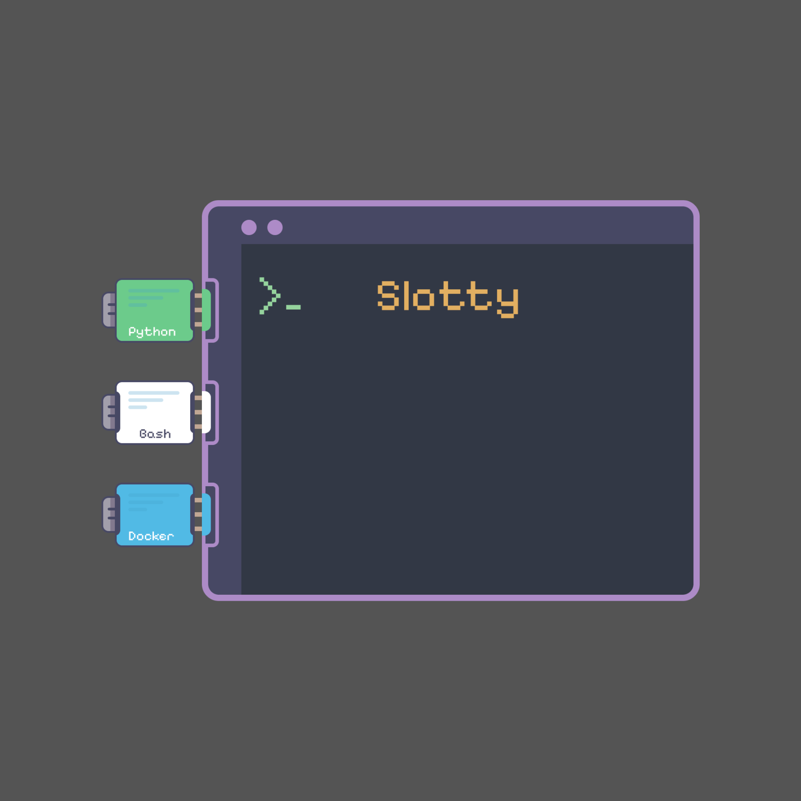

# 🚀 Slotty - Sistema de Gestión de Comandos

<div align="center">
  
</div>

**Slotty** es un sistema de gestión de comandos con interfaz fuzzy search que te permite organizar, buscar y ejecutar comandos rápidamente desde tu terminal.

## Características Principales

- **Búsqueda Fuzzy** - Encuentra comandos al instante con InquirerPy
- **Slots Temáticos** - Organiza comandos por categorías (git, docker, python, etc.)
- **Acceso Rápido** - Configurable con atajos de teclado (F10)
- **Fácil Configuración** - Instalación automática sin dependencias
- **Multiplataforma** - macOS, Linux, WSL2 con soporte completo
- **Binario Nativo** - Ejecutable independiente sin requerir Python
- **Sin Sudo** - Instalación 100% en directorio de usuario

## Requisitos Previos

### Sistema Operativo
- **macOS** (10.15+) - Totalmente compatible
- **Linux** (Ubuntu, Debian, Fedora, Arch, etc.) - Compatible
- **Windows** - A través de WSL2 con ZSH

### Shell Requerido
- **ZSH** (v5.0+) - Requerido (viene por defecto en macOS)
- **Bash** - Compatible
- **Oh My Zsh** - Opcional pero recomendado
- **Powerlevel10k** - Compatible con configuración especial

### Terminales Soportadas
- **iTerm2** (macOS) - Recomendado, mejor soporte de atajos
- **Terminal.app** (macOS nativa) - Compatible
- **GNOME Terminal** (Linux) - Compatible
- **Konsole** (KDE/Linux) - Compatible
- **Alacritty** (multiplataforma) - Compatible
- **WSL Terminal** (Windows) - Compatible

## Instalación

### Opción 1: Instalación Automática (Recomendada)

```bash
# Clonar el repositorio
git clone https://github.com/tu-usuario/slotty.git
cd slotty

# Ejecutar instalador (sin requerir sudo)
./install.sh
```

El instalador automáticamente:
- Copia el binario a `~/.slotty/slotty`
- Copia `slotty_core.sh` a `~/.slotty/`
- Configura tu shell (`.zshrc` o `.bashrc`) para usar `~/.slotty/slotty_core.sh`
- Crea slots de ejemplo en `~/.slotty/slots/`
- **No requiere sudo** - Instalación 100% en directorio de usuario

### Opción 2: Instalación Manual

```bash
# 1. Clonar el repositorio
git clone https://github.com/tu-usuario/slotty.git
cd slotty

# 2. Copiar binario y funciones a ~/.slotty
mkdir -p ~/.slotty/slots
cp dist/slotty ~/.slotty/slotty
chmod +x ~/.slotty/slotty
cp slotty_core.sh ~/.slotty/slotty_core.sh

# 3. Configurar shell
echo 'source ~/.slotty/slotty_core.sh' >> ~/.zshrc
echo 'PROMPT="$(slotty_prompt_info)$PROMPT"' >> ~/.zshrc

# 4. Recargar configuración
source ~/.zshrc
```

#### Para usuarios de Linux

Si estás en Linux, asegúrate de que ZSH sea tu shell por defecto:

```bash
# Verificar shell actual
echo $SHELL

# Cambiar a ZSH si no lo es
chsh -s $(which zsh)

# Reiniciar terminal
```

#### Para usuarios de Powerlevel10k

Si usas **Oh My Zsh + Powerlevel10k**, la configuración de historial es **crucial** porque Powerlevel10k tiene su propio manejo de historial que ignora el truco del espacio inicial unless las opciones `HIST_IGNORE_SPACE` estén configuradas.

## Atajo de Teclado (Opcional)

### Para iTerm2 (macOS)

1. **Abre iTerm2** → Settings (Cmd + ,)
2. **Ve a** Profiles → Keys → Key Bindings
3. **Haz clic en** + para añadir nuevo binding
4. **Configura:**
   - **Keyboard Shortcut:** F10
   - **Action:** Send Text
   - **Value:** `\x15 slotty\n`

### Para Terminal.app (macOS Nativa)

1. **Abre Terminal** → Preferences → Profiles → Keyboard
2. **Haz clic en** + para añadir nuevo atajo
3. **Configura:**
   - **Keyboard Shortcut:** F10
   - **Action:** Send Text
   - **Value:** `^U slotty\n`

### Para Terminales Linux (GNOME, KDE, etc.)

1. **Abre Preferencias de Terminal**
2. **Busca** Atajos de Teclado o Key Bindings
3. **Añade nuevo atajo:**
   - **Tecla:** F10
   - **Comando:** `Ctrl+U` + ` slotty` + `Enter`

### Compatibilidad con Powerlevel10k

Si usas **Oh My Zsh + Powerlevel10k**, es **crucial** agregar estas opciones a tu `.zshrc`:

```bash
# Configuración de historial para Powerlevel10k
setopt HIST_IGNORE_SPACE
setopt HIST_NO_STORE
setopt HIST_VERIFY
```

### Códigos de Tecla por Sistema

| Sistema | Ctrl+U | Formato |
|---------|---------|---------|
| iTerm2 | `\x15` | Hexadecimal |
| Terminal.app | `^U` | Caret notation |
| Linux | `Ctrl+U` | Texto plano |

> **Nota:** En todos los casos, el espacio antes de `slotty` es intencional para evitar que se guarde en el historial (con `HIST_IGNORE_SPACE`).

## 🚀 Uso Básico

### Activar Slots

```bash
# Activar un slot específico
plug git

# Activar múltiples slots
plug git,docker

# Ver slots activos (se muestra en el prompt)
echo $SLOTTY_ACTIVE
```

### Usar Slotty

```bash
# Abrir buscador de comandos
slotty

# Busca y selecciona un comando con las flechas
# Presiona Enter para ejecutarlo
# Presiona ESC para cancelar
```

### Comandos Avanzados

```bash
# Listar todos los slots disponibles
slotty --list-slots

# Agregar un comando a un slot
slotty --add-command "docker run -it --rm ubuntu bash" --to docker

# Eliminar comandos interactivamente
slotty --delete
```

## 🏗️ Estructura de Archivos

### Después de la Instalación

```
~/.slotty/
├── slotty              # Binario ejecutable principal
├── slotty_core.sh      # Funciones del shell
└── slots/             # Directorio de comandos
    ├── docker.txt       # Comandos Docker
    ├── git.txt          # Comandos Git
    └── python.txt       # Comandos Python
```

### Directorio del Proyecto

```
slotty/
├── dist/slotty          # Binario compilado
├── slotty_core.sh      # Funciones del shell
├── install.sh         # Instalador automático
├── uninstall.sh       # Desinstalador completo
├── README.md          # Documentación principal
├── DISTRIBUTION.md    # Guía para mantenedores
├── requirements.txt    # Dependencias Python
├── app.py            # Código fuente
├── slotty.spec        # Configuración PyInstaller
└── create_slots.sh    # Slots de ejemplo
```

## 🎯 Flujo de Trabajo Típico

### 1. Configuración Inicial
```bash
# Instalar Slotty
./install.sh

# Recargar terminal
source ~/.zshrc
```

### 2. Uso Diario
```bash
# Activar slots para tu proyecto actual
plug git,docker,node

# Activar slot uno a uno
plug git

# Abrir Slotty y seleccionar comando
slotty

# El comando aparece en tu terminal listo para ejecutar
```

### 3. Gestión de Comandos
```bash
# Agregar nuevos comandos
slotty --add-command "npm run dev" --to node

# Eliminar comandos que no usas
slotty --delete

# Listar todos tus slots
slotty --list-slots
```

## 🔧 Solución de Problemas

### Comandos No Aparecen
```bash
# Verifica que el slot esté activo
echo $SLOTTY_ACTIVE

# Lista los slots disponibles
slotty --list-slots
```

### Error de "Comando no encontrado"
```bash
# Verifica que ~/.slotty esté en tu PATH
echo $PATH | grep slotty

# Verifica que el binario sea ejecutable
ls -la ~/.slotty/slotty
```

### Atajo F10 No Funciona

**Para iTerm2:**
- Verifica Keyboard Shortcut en Settings → Keys → Key Bindings
- Asegúrate que Action sea "Send Text"
- Verifica que Value sea `\x15 slotty\n`

**Para Terminal.app:**
- Revisa Preferences → Profiles → Keyboard
- Confirma que el atajo esté configurado correctamente
- Usa `^U slotty\n` en lugar de `\x15 slotty\n`

**Para Linux:**
- Verifica que la terminal soporte atajos personalizados
- Prueba con Ctrl+Alt+F10 si F10 no funciona

### Problemas de Colores en el Prompt

Si los colores no se ven correctamente:

```bash
# Verifica tu configuración de terminal
echo $TERM

# Recarga la configuración de Slotty
source ~/.slotty/slotty_core.sh
```

### Error de Historial

Si `slotty` aparece en el historial a pesar del espacio inicial:

```bash
# Verifica las opciones de historial en tu .zshrc
grep -E "HIST_IGNORE|HIST_NO_STORE|HIST_VERIFY" ~/.zshrc

# Agrega las opciones si no existen
echo "setopt HIST_IGNORE_SPACE HIST_NO_STORE HIST_VERIFY" >> ~/.zshrc
```

## 🗑️ Desinstalación Completa

Para desinstalar Slotty completamente sin dejar rastros:

```bash
# Ejecutar desinstalador
./uninstall.sh

# Recargar terminal
source ~/.zshrc
```

El desinstalador:
- ✅ Elimina el binario de `~/.slotty/slotty`
- ✅ Remueve la configuración del shell
- ✅ Crea backup de tu archivo de configuración
- 🗂️ Opcional: elimina todos los datos de `~/.slotty`
- 🚀 **No requiere sudo** - Todo en directorio de usuario

## 🤝 Contribuir

¡Las contribuciones son bienvenidas!

### Para Reportar Issues

1. **Describe el problema** claramente
2. **Incluye tu sistema** (macOS, Linux, terminal)
3. **Proporciona logs** si hay errores
4. **Sugerencias de mejora** son apreciadas

### Para Enviar Pull Requests

1. **Haz fork del proyecto**
2. **Crea una feature branch**
3. **Haz commit de cambios**
4. **Push a tu fork**
5. **Abre Pull Request**

### Desarrollo Local

```bash
# Modificar app.py
vim app.py

# Regenerar binario
source venv/bin/activate
pyinstaller --onefile --name slotty app.py

# Probar cambios
~/.slotty/slotty --help
```

## 📄 Licencia

MIT License - Libre para uso personal y comercial

## 👥 Créditos

Creado con ❤️ para la comunidad de desarrolladores para mejorar la productividad en la terminal, por:
Genaro Coronel
---

**🚀 ¡Instala Slotty hoy y transforma tu experiencia en la terminal!**

## 📚 Comandos Completos

### 1. Búsqueda Normal
```bash
slotty
```
Abre la interfaz fuzzy para buscar y ejecutar comandos.

### 2. Listar Slots Disponibles
```bash
slotty --list-slots
```
Muestra todos los slots con su número de comandos.

### 3. Agregar Comandos
```bash
slotty --add-command "<comando> | <descripción>" --to <slot>
```

**Ejemplos:**
```bash
slotty --add-command "git status | Ver estado del repositorio" --to git
slotty --add-command "docker ps -a | Listar todos los contenedores" --to docker
slotty --add-command "npm run build | Compilar proyecto" --to node
```

### 4. Eliminar Comandos
```bash
slotty --delete
```
Abre una interfaz para seleccionar y eliminar comandos con confirmación.

### 5. Gestión de Slots
```bash
# Activar slot
plug <nombre>

# Desactivar slot específico
unplug <nombre>

# Desactivar todos los slots
unplug
```

## 🏗️ Estructura de Archivos

```
slotty/
├── slotty_core.sh      # Funciones principales del shell
├── app.py              # Interfaz Python con InquirerPy
├── requirements.txt    # Dependencias Python
├── create_slots.sh    # Script para slots de ejemplo
└── ~/.slotty/slots/    # Directorio con archivos .txt de cada slot
```

## 💡 Ejemplos de Uso

### Flujo de Trabajo Típico

```bash
# 1. Ver qué slots tienes disponibles
slotty --list-slots

# 2. Activar el slot que necesitas
plug git

# 3. Agregar comandos personalizados
slotty --add-command "git log --oneline -10 | Ver últimos commits" --to git

# 4. Usar Slotty para buscar y ejecutar comandos
slotty

# 5. Cuando termines, desactiva el slot
unplug git
```

### Comandos Útiles

```bash
# Ver todos tus comandos de git
plug git && slotty

# Agregar rápidamente un nuevo comando
slotty --add-command "kubectl get pods | Ver pods de Kubernetes" --to k8s

# Limpiar slots que no usas
slotty --delete
```

## 🎨 Personalización

### Crear Nuevos Slots

```bash
# Crear un archivo para tu slot
mkdir -p ~/.slotty/slots
touch ~/.slotty/slots/mi-slot.txt

# Agregar comandos (formato: comando | descripción)
echo "ls -la | Listar archivos detallados" >> ~/.slotty/slots/mi-slot.txt
echo "df -h | Ver espacio en disco" >> ~/.slotty/slots/mi-slot.txt

# Activar y usar
plug mi-slot
slotty
```

### Indicador en el Prompt

El prompt mostrará los slots activos:
```
[🔌 git | docker] $ 
```

## 🔧 Solución de Problemas

### Problemas Comunes

#### Comandos No Aparecen
```bash
# Verifica que el slot esté activo
echo $SLOTTY_ACTIVE

# Lista los slots disponibles
slotty --list-slots
```

#### Error de Python
```bash
# Verifica el entorno virtual
source venv/bin/activate
python3 --version

# Reinstalar dependencias
pip install -r requirements.txt
```

#### Atajo F10 No Funciona

**Para iTerm2:**
- Verifica Keyboard Shortcut en Settings → Keys → Key Bindings
- Prueba con otra tecla (F9, F11)
- Asegúrate de que Action sea "Send Text"

**Para Terminal.app:**
- Revisa Preferences → Profiles → Keyboard
- Usa `^U slotty\n` en lugar de `\x15 slotty\n`

**Para Linux:**
- Verifica que la terminal soporte atajos personalizados
- Prueba con Ctrl+Alt+F10 si F10 no funciona

#### Problemas con Powerlevel10k

Si usas Powerlevel10k y los comandos siguen apareciendo en el historial:

```bash
# Verifica que las opciones estén configuradas
grep -E "HIST_IGNORE|HIST_NO_STORE|HIST_VERIFY" ~/.zshrc

# Si no aparecen, agrégalas manualmente
echo "setopt HIST_IGNORE_SPACE HIST_NO_STORE HIST_VERIFY" >> ~/.zshrc
source ~/.zshrc
```

#### Problemas Específicos de Linux

**ZSH no encontrado:**
```bash
# Instalar ZSH en Ubuntu/Debian
sudo apt update && sudo apt install zsh

# Instalar ZSH en Fedora
sudo dnf install zsh

# Instalar ZSH en Arch
sudo pacman -S zsh
```

**Permisos de ejecución:**
```bash
# Hacer ejecutable el script
chmod +x slotty_core.sh
chmod +x create_slots.sh
```

#### Problemas de Rutas

**Error "source: command not found":**
```bash
# Usa ruta absoluta en .zshrc
source /home/tu-usuario/slotty/slotty_core.sh

# O añade al PATH
export PATH="$PATH:/ruta/a/slotty"
```

#### Errores de TTY/Interfaz

Si la interfaz fuzzy no funciona:

```bash
# Verifica que estés en una terminal interactiva
echo $-

# Debe mostrar 'i' entre las opciones
# Si no, prueba en una terminal normal
```

## 📄 Licencia

MIT License - Libre para uso personal y comercial

## 👥 Créditos

Creado con ❤️ para la comunidad de desarrolladores para mejorar la productividad en la terminal, por:
Genaro Coronel

---

**🚀 ¡Instala Slotty hoy y transforma tu experiencia en la terminal!**
